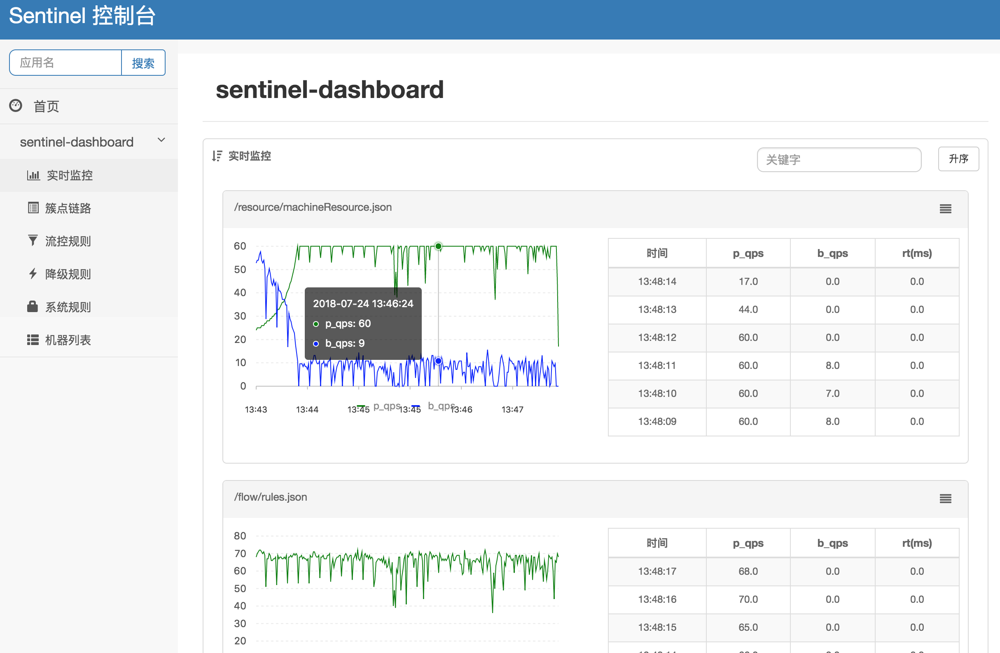
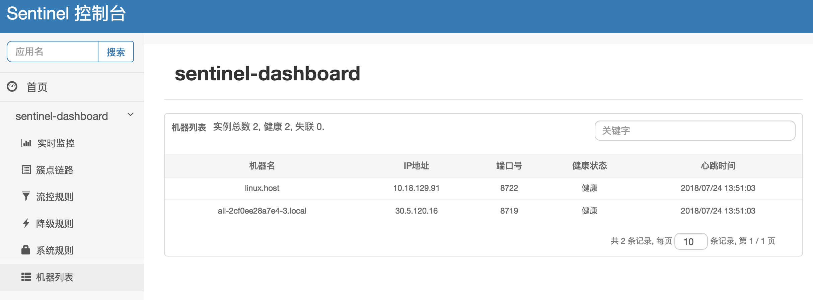
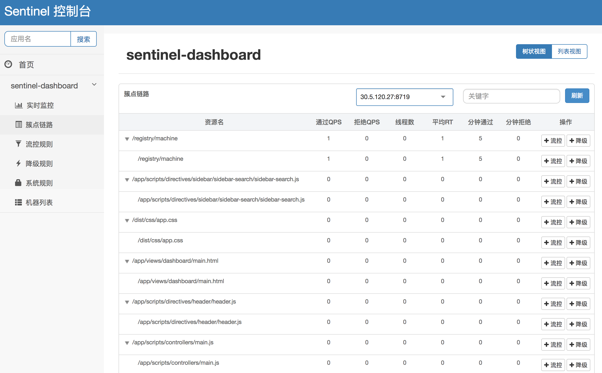
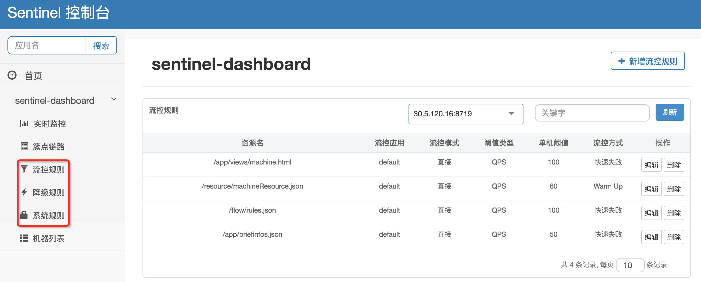

## 1. Introduction
Sentinel also provides a simple stand-alone dashboard, on which you can monitor the clients, and configure the rules in real time. It includes the following features:
* Machine discovery
* Resource monitoring for single machine or clusters with less than 500 nodes
* Rules management



## 2. Start dashboard
### 2.1 Download and compile dashboard
- Download [Dashboard](https://github.com/alibaba/Sentinel/tree/master/sentinel-dashboard) module；
- Package it to fat jar with the following command:
```bash
$ mvn clean package
```
### 2.2 Start Dashboard
Use the following command to start the dashboard：

```bash
$ java -Dserver.port=8080 \
-Dcsp.sentinel.dashboard.server=localhost:8080 \
-jar target/sentinel-dashboard.jar
```
`-Dserver.port=8080` is for the HTTP port。

## 3. Applications
Perform the following 2 steps to connect your application to the dashboard. 

### 3.1 Download JAR
If your project is a pom project, add the following dependency in your pom.xml. Other wise, please download it from Maven.
```xml
<dependency>
    <groupId>com.alibaba.csp</groupId>
    <artifactId>sentinel-transport-simple-http</artifactId>
    <version>x.y.z</version>
</dependency>
```

### 3.2 Configure dashboard IP address

Add dashboard IP address when starting the application: `-Dcsp.sentinel.dashboard.server=consoleIp:port`.

In addition to JVM parameters, you can also do this by configuring property files. For more details, see [Configuration](https://github.com/alibaba/Sentinel/wiki/%E5%90%AF%E5%8A%A8%E9%85%8D%E7%BD%AE%E9%A1%B9).

## 4. Call Resource
After the above steps are completed, if any resource is called, your application will start to send its heartbeat to the dashboard. You can check the following information on the dashboard:

### a. "Machine Discovery" will display machines grouped by their application names



### b. "Resources Tracing" will display resources by machine

**Note:** Resources displayed in "Resource Tracing" are stored in memory.



### c. "Monitor" will summarize resource metrics of all machines in the same application

**Note:** "Monitor" will only record metrics in 5 minutes. If you need to persist these data, please refer to [Metrics](https://github.com/alibaba/Sentinel/wiki/Metrics#history-resource-metrics).


If any information is missed please check your configuration and troubleshoot via record.log and metricStat.log.pid<Pid No>.<Date>. For details please refer to [logs](https://github.com/alibaba/Sentinel/wiki/Logs).

## 5. Manage rules
Dashboard provides rules management as well.

### 5.1 Rule queries

You can query rules on the dashboard via HTTP commands exposed by client site. For details please refer to
 [HTTP command for rules](https://github.com/alibaba/Sentinel/wiki/How-to-Use#http-commands-for-rules).



### 5.2 Rule configruation

You can also change rules on the dashboard in real time via [HTTP command for rules](https://github.com/alibaba/Sentinel/wiki/How-to-Use#http-commands-for-rules).

**Note:** All these rules are stored in memory.

We recommend you to use [Dynamic Rule Configuration](https://github.com/alibaba/Sentinel/wiki/Dynamic-Rule-Configuration) to customize your own rule logic.
